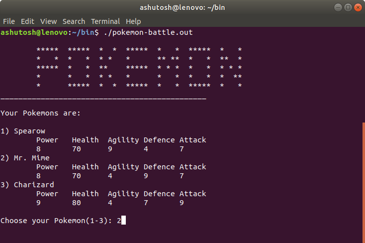

# Pokemon Battle

This is a simple pokemon game based on the concept of playing cards in C++.

## POKEMONS USED

|Pokemon Type|Pokemon one|Pokemon two|
|---|---|---|
|Electric|Pikachu|Voltorb|
|Water|Blastoise|Psyduck|
|Fire|Ninetales|Charizard|
|Flying|Butterfee|Spearow|
|Psychic|Alakazam|Mr. Mime|
|Rock|Golem|Kabutops|

## GAME RULES

- Each, the player and the CPU is assigned 3 Pokemons.
- The user has to select any one Pokemon for fighting
  in the first round with it's corresponding CPU Pokemon
- There are three parameters
	* Agility
	* Attack
	* Defence
	* Special
  
1.) Agility outpowers Defence but is outpowered by Attack

2.) Attack  outpowers Agility but is outpowered by Defence

3.) Defencs outpowers Attack  but is outpowered by Agility

4.) Special is special one-time move which either enhances your abilities by the multiple of your power **OR** Doubles your health.

- After each match, the user is given the choice to choose any other Pokemon
- After all the three matches have finished, the winner is declared.

## CHEATS:
- If you are not satisfied with your pokemon combination,
	  enter "**10101**" in the "Choose your Pokemon (1-3):" input value.
	  *It is also helpful if you want to reset the game.*
- To terminate the game in between, enter "**0**" in any input value.

## HOW TO RUN
- Fork this  repository.
- Clone the this repository by issuing the following command
> $ git clone https://github.com/<your_username>/pokemon-battle.git
- Go to the directory where you've cloned the repository using `cd directory_name`
- Compile the c++ code by issuing the command below in the terminal.
> $ g++ pokemon-battle.cpp -o pokemon-battle.out
- Run the code in the terminal using
> $ ./pokemon-battle.out

## SCREENSHOTS

The pokemons have been assigned to the user.

## WHAT ELSE CAN YOU DO?

A different version of the same C++ program is available for Turbo C++ DOSBOX [here](pokemon-battle-dos.cpp).
This version includes primitive sounds as well.

Follow the same HOW TO RUN instructions replacing `pokemon-battle` with `pokemon-battle-dos`.

You can contact the developer via [linkedin profile](https://www.linkedin.com/in/ashutosh-singh-a69170170/).

**This program is open for suggestions and pull requests. Your feedback is highly appreciated.**
